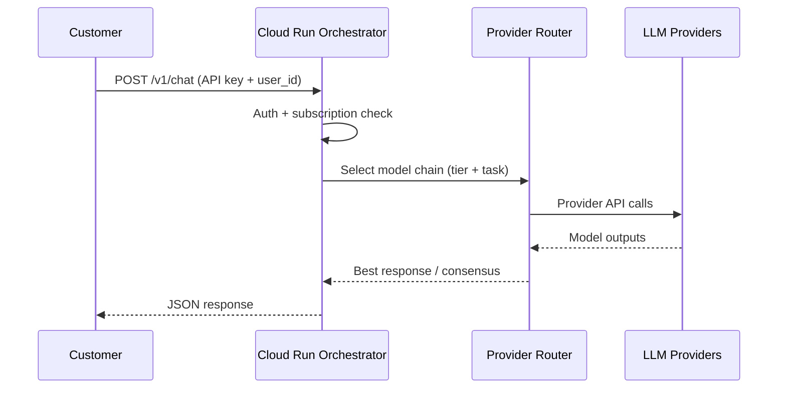

# Architecture overview — marketplace listings

Use this narrative + diagram in AWS/GCP product detail pages. Do not promise SLAs beyond Enterprise contracts.

---

## Components

1. **Customer** — Browser (workspace) or server (API integration)
2. **LLMHive web app** — Next.js on Vercel; Clerk auth; Stripe billing
3. **Orchestrator** — Python/FastAPI on Google Cloud Run (`llmhive-orchestrator`)
4. **Provider layer** — Direct and aggregated LLM APIs (keys in GCP Secret Manager)
5. **Data services** — Firestore (subscriptions), optional Pinecone (strategy/RAG), provider-specific storage

---

## Request path (API)

---

## Deployment model for marketplace

- **Delivery:** SaaS — multi-tenant shared orchestrator
- **Not included:** Customer VPC install, BYOK-only on-prem (unless separate enterprise deal)
- **Scaling:** Cloud Run autoscaling
- **Isolation:** Logical tenant isolation via `user_id` and API keys; shared compute

---

## Network

- Ingress: HTTPS only
- Egress: HTTPS to provider endpoints
- Secrets: GCP Secret Manager; not embedded in images

---

## Diagram asset

For portal upload, export a simple block diagram:

`[Customer] → [Vercel App] → [Cloud Run API] → [Provider APIs]`

Optional: generate PNG from this mermaid in GitHub or draw.io for AWS “Architecture” upload field.
